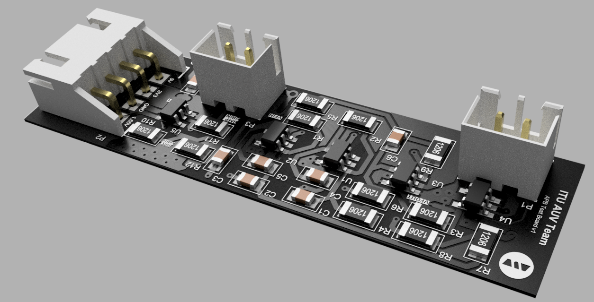

# Acoustic Processing Board (APB) Hardware

The Acoustic Processing Board (APB) is a specialized hardware project devoted to processing underwater acoustic signals, captured via hydrophones. This repository houses the electronic design and hardware specifications needed to construct or adapt the APB. Serving as a crucial tool for underwater exploration, navigation, and communication, the APB stands as a testament to innovative engineering solutions. This project is developed for ITU AUV Team.

<picture>    </picture>

<em >APB Filter Test Board</em>

<picture>    </picture>

    

<em >AUV Electronics 2022</em>

<picture>    </picture>

    

<picture>    </picture>

    

<picture>    </picture>

## Table of Contents
- [Acoustic Processing Board (APB) Hardware](#acoustic-processing-board-apb-hardware)
  - [Table of Contents](#table-of-contents)
  - [Project Description](#project-description)
  - [Electronics Design](#electronics-design)
    - [Hydrophone Biasing](#hydrophone-biasing)
    - [Pre-Amplification](#pre-amplification)
    - [6 Pole Butterworth Bandpass Filter](#6-pole-butterworth-bandpass-filter)
    - [Analog Power Supply](#analog-power-supply)
    - [ADC Buffering](#adc-buffering)
  - [Simulation](#simulation)
  - [Filter Test Board](#filter-test-board)
    - [Layer Structure](#layer-structure)
    - [Manufacturing](#manufacturing)
  - [Digital Part](#digital-part)
  - [Technologies Used](#technologies-used)
  - [License](#license)
  - [Project Timeline](#project-timeline)
  - [Gallery](#gallery)

## Project Description

The Acoustic Processing Board (APB) is a pivotal development in the field of Autonomous Underwater Vehicles (AUVs), designed to accurately detect the positions of underwater objects. To optimize performance, APB is split into two distinct parts: an analog PCB and a digital PCB.

The focus of this repository is the analog PCB, which primarily serves as a bandpass filter for frequencies between 25 and 40kHz. This PCB is designed to filter incoming signals from hydrophones before they are passed onto the digital component of the APB. The board was meticulously designed and simulated using LTspice software, featuring components from Analog Devices. The physical layout of the PCB was then accomplished using Altium Designer.

In addition to the analog PCB, there is a complementary digital PCB. This board is responsible for processing the filtered signals from three hydrophones to determine the location of objects underwater. It employs Fast Fourier Transform (FFT) algorithms for signal processing, and is powered by an STM32 microcontroller.

In the interest of thorough testing and performance optimization, the first iteration of the filter PCB was designed for a single hydrophone. This approach enables focused testing on the filtering capabilities, allowing for incremental improvements and fine-tuning of the board's performance before scaling to a three-hydrophone system.

The APB is a testament to innovative design, offering a unique approach to signal processing for AUVs. It represents a significant contribution to our understanding and exploration of underwater environments. We encourage you to explore the repository, understand the design, and contribute to the ongoing development of this cutting-edge technology.

<picture>    </picture>

## Electronics Design

The APB Analog's design is a combination of intricate electronic engineering concepts and high-precision layout work. For an in-depth understanding of its composition, be sure to check the [Full schematics](/LTSpice_Simulation/Full%20Schematic.pdf) and [PCB Schematic Sheets](/Schematic%20Sheets/) These documents not only delineate the arrangement and interconnectivity of the board's components, but also offer insightful details about their specific roles and functionalities. Whether you're interested in the bandpass filtering process, power distribution, or the input/output interfaces, the schematic sheets hold the key to understanding the APB Analog's operational architecture.

### Hydrophone Biasing 

Hydrophone biasing is the first stage in our APB design, and it's vital to the overall functionality of the system. For each of the three hydrophones, a Vhyd- and Vhyd+ and Vcc are the inputs, while Vampin is the output. Importantly, Vhyd- is grounded. This arrangement ensures the correct biasing of the hydrophones, setting the correct operating point for each device and allowing for the effective conversion of underwater acoustic signals into electrical signals.

    

### Pre-Amplification

The pre-amplification stage is another essential component of our APB design, ensuring that the electrical signals produced by the hydrophones are amplified adequately for further processing. This stage also employs three separate units, one for each hydrophone. Vampin is used as the input, while Vfin serves as the output. The pre-amplifier is driven by a high precision op-amp, ensuring low-noise amplification and thereby enhancing the clarity and resolution of the captured signals.

    

### 6 Pole Butterworth Bandpass Filter

To further process the amplified signals, we employ a 6-pole Butterworth bandpass filter. This filter is replicated three times, once for each hydrophone. The selection of this specific filter topology allows for a flat frequency response in the passband, and a fast roll-off rate, making it highly suitable for our signal processing needs. Appropriate capacitor and resistor values were determined using Analog Devices' application notes. The filter takes Vfin as an input and outputs a filtered signal, Vfout. Each operational amplifier in this stage is referenced with Agnd, which is supplied by the analog power supply circuit.

    

### Analog Power Supply

The analog power supply is an integral part of our design. Va is the input, and Agnd is the output. This unit provides the necessary power for all analog sections of the APB. Va and Agnd form the positive and negative poles of the op-amp in the other circuits. By generating a stable and low-noise power supply, this circuit ensures that the operational amplifiers and other analog components function optimally, minimizing signal distortion and maintaining high signal-to-noise ratios.

    

### ADC Buffering

ADC buffering serves as the bridge between the analog and digital domains of our APB design. This stage, replicated three times for each hydrophone, takes the filtered signal, Vfout, as input and provides Vadc as output. The buffer, a unity gain amplifier (1x amp), plays a critical role in this system. Its purpose is to isolate the preceding stages from the ADC load. This isolation prevents any impedance mismatch that could degrade the signal quality. By using a buffer, we ensure that the signals processed by the ADC reflect as closely as possible the filtered signals from the bandpass filter stage, enabling accurate digital representation of the original acoustic signals.

    

## Simulation

The APB analog subsystem was thoroughly simulated using LTspice, a high-performance SPICE simulator. LTspice offers a variety of capabilities, including enhanced SPICE and an integrated waveform viewer, making it a powerful tool for circuit analysis.

The simulation process involved the use of specific op-amps from Analog Devices. This choice of op-amps was driven by their favorable characteristics, such as low noise, high precision, and their performance within the frequency band of interest.

To ascertain the effectiveness of our 6-pole Butterworth bandpass filter design, we carried out frequency domain analysis. The results are demonstrated in the Bode plot below. As can be seen, the filter provides a passband for frequencies between 25 and 40 kHz, while attenuating frequencies outside this band. This frequency range was chosen specifically to match the operating range of the hydrophones and the acoustic signals they receive.

The simulation results validate the performance of the filter design and provide confidence in its ability to function as intended in the real-world application.

    

## Filter Test Board

As part of our development and testing process, we designed a standalone PCB specifically for testing the performance of the filter stage and associated circuits. This board, known as the Filter Test Board, includes only the Butterworth filter, ADC buffering, and pre-amplification circuits, all for just a single hydrophone. 

The Filter Test Board contains crucial components from our original APB analog design that we aimed to test in isolation. We included the Butterworth filter stage, which is the centerpiece of our acoustic processing, to evaluate its frequency response and signal attenuation properties. The Pre-Amplification stage is also included, as it plays a crucial role in enhancing the signals coming from the hydrophone. Additionally, the ADC Buffering stage is incorporated into it. This stage is crucial for isolating the ADC load from the preceding stages, thereby preserving signal integrity. By focusing on these critical parts, the Filter Test Board allows us to verify the operation and performance of the main building blocks of our system without the interference of other elements. As a summary, It is basically includes cruical parts to process one hydrophone signal.

To aid in testing, we've added test points at key output locations like Vampin or Vfin as you can see in the below pcb picture, allowing for easy hook-up of measurement equipment such as oscilloscopes or signal generators. This way, we can inject signals and observe the system's response directly. We gave some voltages such as 1.65V directly to get rid of some power circuits.

Furthermore, we've chosen to use industrial-grade connectors for power supply and signal output. These connectors provide robust, reliable connections, crucial for both testing and eventual deployment.

The schematic diagrams for the Filter Test Board are available in the repository at [PCB Schematic Sheets](/Schematic%20Sheets/). Here, you'll find the full details of the circuits on the test board, providing a wealth of information for understanding and troubleshooting.

Below is top view of the Filter Test Board:

<picture>    </picture>

### Layer Structure

This test version of the APB Analog PCB utilizes a two-layer structure, which has been chosen to simplify the initial stages of testing and troubleshooting. Once the test phase is complete and the design is deemed satisfactory, a transition to a four-layer PCB will take place for the original design. The change in layers not only accommodates the increased complexity of handling signals from three hydrophones simultaneously but also provides better noise isolation and improved signal integrity. Our filter test board's layers can be seen below.

<picture>    </picture>

To understand the depth of the board structure, component placement, and routing of traces, you can check out the [PCB file](/APB_Filter_Test_Board.PrjPcb). It offers a visual representation of the board, aiding in a better understanding of how the circuit's design translates into the physical realm. Keep in mind that this transition from a two-layer board to a four-layer one marks a critical milestone in the evolution of the APB project, embodying the growth from a test concept to a fully-realized, operational piece of hardware.

### Manufacturing

In order to ensure that our Filter Test Board design meets the specific manufacturing specifications of our chosen PCB manufacturer, we have employed the Design Rule Check (DRC) feature in Altium Designer. You can check the detailed report of this rule verification in the output files directory. 

The necessary Gerber files, which include the comprehensive manufacturing details needed to transform our electronic design into a tangible board, are compiled in the [Output](/Output%20Files/) directory.

To date, we have prototyped the Filter Test Board with our manufacturing partner, JLC PCB. Using the invaluable feedback and insights acquired from each iteration, we have continuously refined and improved the design, ensuring it's prepared for rigorous testing and eventual integration into the full Acoustic Processing Board system.

Below you can see some of the pictures of PCBs we manufactured:

<picture>    </picture>

<picture>    </picture>

## Digital Part

The Digital Part represents the second crucial stage of the Acoustic Processing Board (APB). After the Analog Part processes the signals from the hydrophones, it's the responsibility of the Digital Part to receive these analog signals, evaluate them, and ultimately pinpoint the location of the acoustic source underwater.

One of the core operations conducted by the Digital Part involves Fast Fourier Transforms (FFTs). FFTs are a fundamental algorithm in signal processing and analysis, serving to convert a signal from the time domain (where each point represents amplitude at a specific time) into the frequency domain (where each point represents amplitude at a specific frequency). In the context of our APB, we use FFTs to identify the dominant frequencies present in the signals received from the hydrophones, which, when triangulated, can help determine the location of the underwater sound source.

The computational demands of these FFT operations are shouldered by an STM32H743 microcontroller. This powerful microcontroller is well-equipped to handle the processing needs of our board, boasting impressive capabilities, such as handling complex FFT operations and processing data from multiple hydrophones concurrently.

As of the time you're reading this, the development of the Digital Part is still underway. We are committed to achieving a robust, reliable digital signal processing system that effectively complements the analog processing capabilities of the APB. Stay tuned for updates as we continue to progress in this exciting project.

## Technologies Used

- **LTSpice:** At the outset of our design process, we used LTSpice, a high-performance SPICE simulator, for schematic capture and waveform viewer. This tool allowed us to simulate and analyze the behavior of our circuit designs, including the hydrophone biasing, pre-amplification, and filtering stages.

- **Analog Devices Web Applications:** To calculate the optimal values for our 6-Pole Butterworth Bandpass Filter components, we made use of the web applications provided by Analog Devices. These tools were indispensable in ensuring the correct operation of our filters, which play a critical role in the overall performance of the APB.

- **Altium Designer:** Our primary tool for crafting the complex layout of the PCBs was Altium Designer. Its powerful capabilities and intuitive interface allowed us to efficiently design, validate, and prepare the board's electronic components for manufacturing. Its extensive features facilitated the smooth handling of multi-layer board designs.

- **Eagle:** As an alternative to Altium Designer, we also used Autodesk Eagle for some aspects of the design process. Eagle offered us a simpler, more streamlined interface for initial design and testing stages, before transitioning to the more robust Altium Designer for finalizing the intricate multi-layer layout.

- **Fusion 360:** To manage the mechanical design and rendering of the APB, we used Autodesk Fusion 360. This powerful CAD/CAM tool not only allowed us to visualize and perfect the physical design of the board but also helped us ensure its compatibility within the AUV. The integration capabilities of Fusion 360 also facilitated seamless coordination with the mechanical team.

## License

This repository contains the design and documentation for the AUV Acoustic Processing Board, a project by the ITU AUV Team Electonics 2022.

**Licensor:** ITU AUV Team 2022 Electronics

This work is licensed under a [Creative Commons Attribution-NonCommercial-ShareAlike 4.0 International License](http://creativecommons.org/licenses/by-nc-sa/4.0/). You can view the full terms of the license in the [LICENSE](./LICENSE) file in this repository.

**Please note:** When using this project, you must give appropriate credit, including a link to the original GitHub repository: [https://github.com/onur-ulusoy/AUV-Acoustic-Processing-Board](https://github.com/onur-ulusoy/AUV-Acoustic-Processing-Board)

## Project Timeline

This Acoustic Processing Board (APB) project, a significant contribution to the 2022 Electronics Team of ITU AUV (Istanbul Technical University's Autonomous Underwater Vehicle), spanned from December 2021 to August 2022. 

In the initial design and simulation stages of the project, Onur Ulusoy and Sencer Yazıcı diligently worked to create an effective system for processing signals from underwater hydrophones. Their efforts involved comprehensive electronic design and meticulous simulation using LTSpice and Analog Devices' applications. 

Once the design was validated through simulation, the next stage of the project involved the physical realization of the APB. The Filter Test PCB, an essential component of the project, was designed, have manufactured, and typeset by Onur Ulusoy. This crucial testing PCB was brought to life using Altium Designer, with the manufacturing process carried out by JLCPCB. 

While the project was ongoing, thorough documentation was maintained by Onur Ulusoy. His efforts provided an accurate and detailed record of the project, documenting key design decisions, simulation results, and changes made during the PCB design and testing stages. 

As of the current timeline, the Digital Part of the APB, which is designed to receive and analyze the processed signals, is not yet completed. However, the successful development and testing of the APB's analog parts mark significant milestones towards the final goal. 

We are grateful for the invaluable guidance provided by Sencer Yazıcı throughout the development process. His expertise and mentorship played a crucial role in the success of this project. 

Throughout the duration of the Acoustic Processing Board (APB) project, we utilized Trello as our primary project management tool. Trello's intuitive interface and flexible features allowed us to plan, track, and coordinate our tasks effectively. By creating distinct cards for different tasks and using lists to represent different stages of our workflow, we were able to maintain a clear overview of our progress at all times. 

## Gallery

For a visual tour of the APB Filter Test Board PCB, you can explore our [gallery](https://onur-ulusoy.github.io/AUV-Acoustic-Processing-Board/Media/gallery.html). Here you'll find detailed images showcasing the design and implementation of the board.

